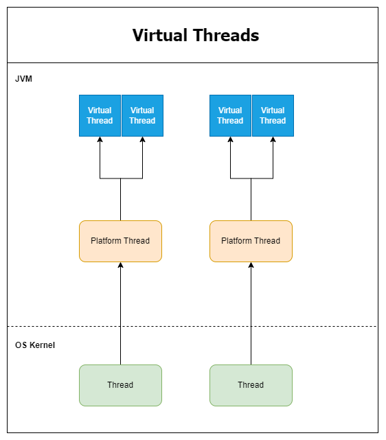

## Java Virtual Threads Demo

Basic example to demonstrate the working of Platform and Virtual Threads.

More details around threads can be found [here](https://docs.oracle.com/en/java/javase/21/core/virtual-threads.html)

### Requirements
 - JDK 21
 - You can use any compatible IDE or CLI to compile and execute the program

### Diagram

### Scenarios
 - [NonVirtualThreadDemo](src/main/java/com/vt/NonVirtualThreadDemo.java) uses Platform Thread to demonstrate the blocking nature of Thread execution
 - [VirtualThreadDemo](src/main/java/com/vt/VirtualThreadDemo.java) uses Virtual Thread to demonstrate the mounting and unmounting of Threads